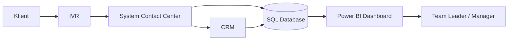
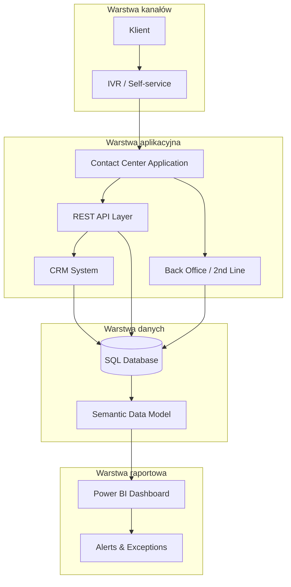
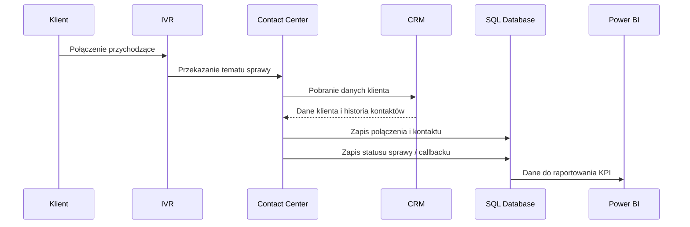

# Architektura rozwiązania — Contact Center

## Cel dokumentu

Dokument opisuje koncepcyjną architekturę rozwiązania wspierającego proces obsługi połączeń w Contact Center.

Architektura obejmuje komponenty odpowiedzialne za:

- obsługę połączeń przychodzących,
- obsługę IVR i samoobsługi,
- rejestrację zgłoszeń,
- obsługę callbacków,
- integrację z CRM,
- zasilenie modelu danych SQL,
- raportowanie KPI w Power BI.

Dokument przedstawia architekturę na poziomie logicznym, z perspektywy analityka biznesowo-systemowego.

---

## Kontekst rozwiązania

Proces Contact Center obejmuje obsługę klientów kontaktujących się w sprawach faktur, reklamacji, problemów technicznych oraz zgłoszeń wymagających eskalacji.

W procesie TO-BE założono następujące usprawnienia:

- self-service w IVR dla prostych spraw,
- callback dla klientów oczekujących w kolejce,
- tagowanie przyczyn kontaktu,
- monitorowanie SLA,
- raportowanie KPI,
- analizę efektywności konsultantów i zespołów.

---

## Diagram kontekstowy

---

## Komponenty rozwiązania

| Komponent | Odpowiedzialność |
|---|---|
| IVR | Obsługa wyborów klienta, self-service, callback, przekierowanie do kolejki |
| System Contact Center | Obsługa połączeń, rejestracja kontaktów, przypisanie konsultanta |
| CRM | Dane klienta, historia kontaktów, statusy spraw |
| SQL Database | Centralny model danych wykorzystywany do analizy operacyjnej |
| Power BI | Warstwa raportowa prezentująca KPI i alerty operacyjne |
| Back Office / 2nd Line | Obsługa spraw wymagających eskalacji |
| REST API Layer | Warstwa komunikacji pomiędzy komponentami systemu |

---

## Architektura logiczna

---

## Opis warstw architektury

### Warstwa kanałów

| Element | Opis |
|---|---|
| Klient | Osoba kontaktująca się z Contact Center |
| IVR | System obsługujący wybór tematu sprawy, self-service i callback |
| Self-service | Obsługa prostych spraw bez udziału konsultanta |

### Warstwa aplikacyjna

| Element | Opis |
|---|---|
| Contact Center Application | Obsługa połączeń, rejestracja kontaktów, przekierowania |
| REST API Layer | Komunikacja pomiędzy systemami |
| CRM System | Dane klienta, historia kontaktów, statusy spraw |
| Back Office / 2nd Line | Obsługa spraw eskalowanych |

### Warstwa danych

| Element | Opis |
|---|---|
| SQL Database | Relacyjna baza danych z tabelami calls, cases, contacts, agents, customers |
| Semantic Data Model | Model danych przygotowany pod raportowanie KPI |
| Data Quality Rules | Reguły spójności i kompletności danych |

### Warstwa raportowa

| Element | Opis |
|---|---|
| Power BI Dashboard | Dashboard operacyjny i zarządczy |
| Alerts & Exceptions | Widok spraw po SLA, niezrealizowanych callbacków i wysokiego AHT |
| KPI Monitoring | Monitorowanie SLA, FCR, AHT, ASA, Abandonment Rate |

---

## Przepływ danych

---

## Kluczowe przepływy biznesowe

| ID | Przepływ | Opis |
|---|---|---|
| PF.01 | Obsługa połączenia przez konsultanta | Klient przechodzi przez IVR, trafia do kolejki i jest obsługiwany przez konsultanta |
| PF.02 | Self-service w IVR | Prosta sprawa zostaje obsłużona automatycznie bez udziału konsultanta |
| PF.03 | Callback | Klient wybiera oddzwonienie zamiast oczekiwania w kolejce |
| PF.04 | Eskalacja do 2nd line | Złożona sprawa zostaje przekazana do zespołu drugiej linii |

---

## Integracje systemowe

| Integracja | Kierunek | Cel |
|---|---|---|
| IVR → Contact Center | Jednokierunkowa | Przekazanie tematu sprawy, wyboru self-service lub callbacku |
| Contact Center ↔ CRM | Dwukierunkowa | Pobranie danych klienta i aktualizacja historii kontaktów |
| Contact Center → SQL Database | Jednokierunkowa | Zapis danych operacyjnych |
| CRM → SQL Database | Jednokierunkowa | Zasilenie modelu danych informacjami o kliencie |
| Back Office / 2nd Line → SQL Database | Jednokierunkowa | Zasilenie modelu informacjami o eskalacjach |
| SQL Database → Power BI | Jednokierunkowa | Raportowanie KPI i alertów |

---

## Model danych na poziomie logicznym

| Encja | Opis |
|---|---|
| customers | Dane klientów |
| calls | Dane połączeń przychodzących |
| cases | Dane zgłoszeń i spraw |
| contacts | Historia kontaktów klienta |
| agents | Dane konsultantów |
