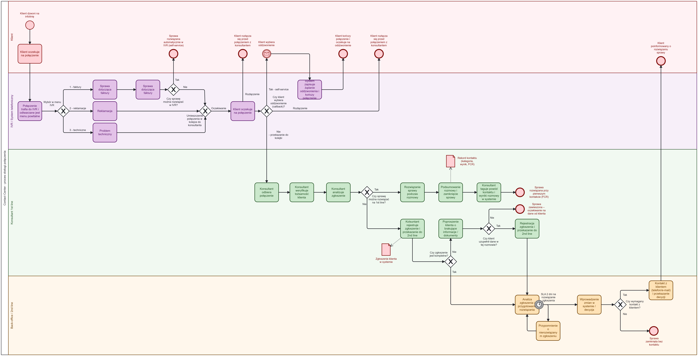
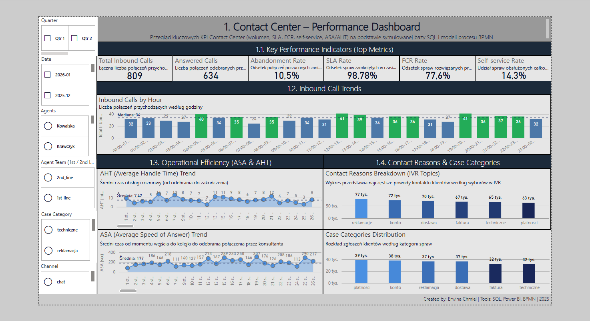
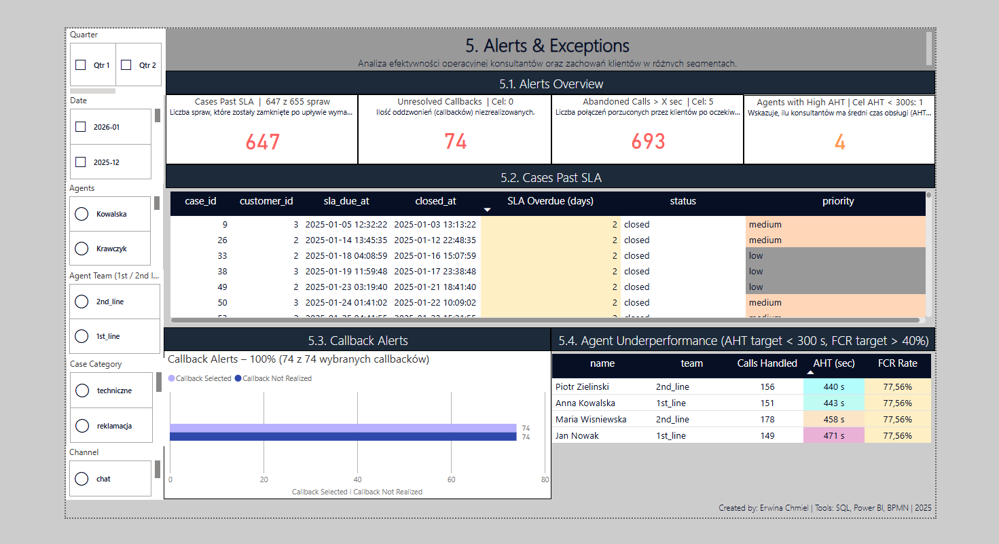

# Contact Center Process Optimization — BPMN + SQL + Power BI

> Portfolio project showing a full business, process, system, data and BI analysis case study for a Contact Center process.


---

## O projekcie

Projekt przedstawia kompletne case study optymalizacji procesu obsługi połączeń przychodzących w Contact Center.

Celem projektu jest pokazanie pełnego toku pracy analitycznej — od identyfikacji problemu biznesowego, przez analizę wymagań i modelowanie procesu BPMN AS-IS / TO-BE, aż po zaprojektowanie architektury logicznej, integracji, specyfikacji API, modelu danych SQL oraz dashboardu KPI w Power BI.

Projekt został przygotowany jako portfolio analityczki biznesowo-systemowej i BI, pokazujące pracę na styku biznesu, procesów, systemów, danych, SQL, REST API, OpenAPI, raportowania KPI i Power BI.

---

## Cel projektu

Celem projektu jest zaprezentowanie, w jaki sposób można przejść od problemów operacyjnych w Contact Center do uporządkowanego rozwiązania analityczno-systemowego.

Projekt obejmuje:

- analizę problemu biznesowego,
- analizę interesariuszy,
- inżynierię wymagań,
- User Stories i kryteria akceptacji,
- backlog produktu,
- modelowanie procesu BPMN AS-IS i TO-BE,
- opis architektury logicznej rozwiązania,
- analizę integracji między systemami,
- przykładową specyfikację REST API,
- plik OpenAPI zgodny ze standardem OpenAPI 3.0,
- projekt relacyjnego modelu danych SQL,
- dane przykładowe,
- zapytania SQL dla KPI,
- dashboard operacyjny w Power BI,
- analizę KPI: FCR, SLA, AHT, ASA, Abandonment Rate, Callback Rate, Self-service Rate.

---

## Zakres biznesowy

Projekt dotyczy procesu obsługi połączeń przychodzących w Contact Center.

W analizie uwzględniono:

- obsługę połączeń przez IVR,
- klasyfikację tematu kontaktu,
- obsługę przez konsultanta 1st line,
- eskalację do 2nd line / back-office,
- samoobsługę w IVR,
- callback jako alternatywę dla oczekiwania w kolejce,
- monitorowanie SLA,
- oznaczanie przyczyny kontaktu i wyniku rozmowy,
- przygotowanie danych pod raportowanie KPI.

---

## Główne problemy biznesowe

W procesie AS-IS zidentyfikowano następujące problemy:

- długi czas oczekiwania klientów na połączenie,
- wysoki poziom porzuconych połączeń,
- ograniczony zakres samoobsługi w IVR,
- brak callbacku jako alternatywy dla oczekiwania w kolejce,
- niewystarczającą kontrolę SLA,
- ograniczoną analizę przyczyn kontaktu,
- brak pełnej widoczności KPI operacyjnych,
- utrudnione monitorowanie efektywności konsultantów,
- brak spójnego modelu danych do raportowania.

Proces TO-BE odpowiada na te problemy poprzez:

- self-service w IVR dla prostych spraw,
- callback dla klientów oczekujących w kolejce,
- tagowanie przyczyn kontaktu i wyniku rozmowy,
- lepsze monitorowanie SLA,
- sprawniejszą eskalację do 2nd line,
- przygotowanie danych do raportowania KPI,
- uporządkowany model danych SQL,
- dashboard Power BI dla liderów i menedżerów.

---

## Pytania biznesowe, na które odpowiada projekt

Dashboard i dokumentacja analityczna odpowiadają m.in. na pytania:

- W których godzinach Contact Center ma największe obciążenie?
- Jaki jest poziom FCR i SLA dla całego procesu oraz poszczególnych zespołów?
- Które typy spraw najczęściej wymagają eskalacji do 2nd line?
- Ilu klientów korzysta z self-service w IVR?
- Ilu klientów wybiera callback zamiast oczekiwania w kolejce?
- Czy callbacki są realizowane terminowo?
- Którzy konsultanci mają podwyższony AHT lub niższy FCR?
- Ile spraw przekroczyło SLA?
- Jakie kategorie kontaktu generują największe obciążenie?
- Jak zmienia się ASA w ujęciu godzinowym?
- Jak zmienia się AHT w ujęciu dziennym?
- Które segmenty klientów generują największy wolumen połączeń?
- Ilu callbacków nie udało się zrealizować?
- Które alerty operacyjne wymagają reakcji lidera zespołu?

---

## Logika projektu

Projekt został uporządkowany zgodnie z naturalną kolejnością pracy analitycznej:

```text
Problem biznesowy
        ↓
Interesariusze i potrzeby
        ↓
Wymagania biznesowe, funkcjonalne i niefunkcjonalne
        ↓
User Stories i kryteria akceptacji
        ↓
Backlog produktu
        ↓
Proces AS-IS i TO-BE w BPMN
        ↓
Architektura logiczna rozwiązania
        ↓
Integracje i REST API
        ↓
Specyfikacja OpenAPI
        ↓
Model danych SQL
        ↓
Dane przykładowe
        ↓
Zapytania KPI
        ↓
Dashboard Power BI
        ↓
Wnioski biznesowe i rekomendacje
```

Dzięki temu repozytorium pokazuje nie tylko końcowy dashboard, ale cały proces dochodzenia do rozwiązania.

---

## Szybkie linki do folderów

| Obszar | Folder |
|---|---|
| Project overview | [00_project-overview](00_project-overview/) |
| Business analysis | [01_business-analysis](01_business-analysis/) |
| Process analysis — BPMN | [02_process-analysis](02_process-analysis/) |
| Solution architecture | [03_solution-architecture](03_solution-architecture/) |
| Data model — SQL | [04_data-model](04_data-model/) |
| Power BI dashboard | [05_power-bi-dashboard](05_power-bi-dashboard/) |
| Documentation | [06_documentation](06_documentation/) |

---

## Struktura repozytorium

```text
contact-center-process/
│
├── 00_project-overview/
│   ├── 00_01_project-context.md
│   ├── 00_02_how-to-read-this-project.md
│   ├── 00_03_scope-and-assumptions.md
│   └── 00_04_requirements-workshops.md
│
├── 01_business-analysis/
│   ├── 01_01_business-problem.md
│   ├── 01_02_stakeholder-analysis.md
│   ├── 01_03_requirements.md
│   ├── 01_04_user-stories.md
│   ├── 01_05_acceptance-criteria.md
│   └── 01_06_backlog.md
│
├── 02_process-analysis/
│   ├── 02_01_bpmn-as-is.bpmn
│   ├── 02_02_bpmn-as-is.png
│   ├── 02_03_bpmn-to-be.bpmn
│   ├── 02_04_bpmn-to-be.png
│   ├── 02_05_as-is-process-description.md
│   ├── 02_06_to-be-process-description.md
│   └── 02_07_bpmn-modeling-decisions.md
│
├── 03_solution-architecture/
│   ├── 03_01_architecture.md
│   ├── 03_02_integrations.md
│   ├── 03_03_api-specification.md
│   ├── 03_04_openapi.yaml
│   └── 03_05_api-governance-notes.md
│
├── 04_data-model/
│   ├── 04_01_database-schema.sql
│   ├── 04_02_sample-data.sql
│   ├── 04_03_kpi-queries.sql
│   └── 04_04_data-model-description.md
│
├── 05_power-bi-dashboard/
│   ├── 05_01_contact-center-kpis-dashboard.pbix
│   ├── 05_02_dashboard-overview.png
│   ├── 05_03_call-flow-sla-fcr-callback.png
│   ├── 05_04_operational-analytics.png
│   ├── 05_05_segments-and-agents-analysis.png
│   ├── 05_06_alerts-and-exceptions.png
│   ├── 05_07_dashboard-kpi-pages.md
│   ├── 05_08_dashboard-business-insights.md
│   ├── dax/
│   │   ├── measures_alerts.dax
│   │   ├── measures_callbacks.dax
│   │   ├── measures_calls.dax
│   │   └── measures_cases.dax
│   └── semantic-model/
│       ├── measures-catalog.md
│       └── relationships.md
│
├── 06_documentation/
│   ├── 06_01_analytical-approach.md
│   ├── 06_02_glossary.md
│   ├── 06_03_traceability-matrix.md
│   ├── 06_04_run-instructions.md
│   └── 06_05_security-and-data-governance.md
│
└── README.md
```

---

## Jak czytać projekt?

Rekomendowana kolejność czytania:

1. Zacznij od `README.md`, aby zrozumieć cel projektu, zakres i strukturę repozytorium.
2. Przejdź do `00_project-overview/`, aby poznać kontekst projektu, założenia oraz sposób czytania repozytorium.
3. Otwórz `01_business-analysis/`, gdzie znajdują się problem biznesowy, interesariusze, wymagania, User Stories, kryteria akceptacji i backlog.
4. Przejdź do `02_process-analysis/`, aby porównać proces AS-IS i TO-BE.
5. Sprawdź `03_solution-architecture/`, aby zobaczyć architekturę logiczną, integracje, REST API i OpenAPI.
6. Przejdź do `04_data-model/`, aby zobaczyć schemat bazy danych, dane przykładowe, KPI SQL i opis modelu danych.
7. Otwórz `05_power-bi-dashboard/`, aby zobaczyć PBIX, podglądy dashboardu, miary DAX i model semantyczny.
8. Na końcu sprawdź `06_documentation/`, gdzie znajdują się podejście analityczne, słownik, traceability matrix, instrukcje uruchomienia oraz security & data governance.

---

## Najważniejsze artefakty

| Obszar | Plik |
|---|---|
| Kontekst projektu | [00_01_project-context.md](00_project-overview/00_01_project-context.md) |
| Instrukcja czytania projektu | [00_02_how-to-read-this-project.md](00_project-overview/00_02_how-to-read-this-project.md) |
| Zakres i założenia | [00_03_scope-and-assumptions.md](00_project-overview/00_03_scope-and-assumptions.md) |
| Warsztaty wymagań | [00_04_requirements-workshops.md](00_project-overview/00_04_requirements-workshops.md) |
| Problem biznesowy | [01_01_business-problem.md](01_business-analysis/01_01_business-problem.md) |
| Wymagania | [01_03_requirements.md](01_business-analysis/01_03_requirements.md) |
| User Stories | [01_04_user-stories.md](01_business-analysis/01_04_user-stories.md) |
| Proces AS-IS BPMN | [02_01_bpmn-as-is.bpmn](02_process-analysis/02_01_bpmn-as-is.bpmn) |
| Proces TO-BE BPMN | [02_03_bpmn-to-be.bpmn](02_process-analysis/02_03_bpmn-to-be.bpmn) |
| Podgląd AS-IS | [02_02_bpmn-as-is.png](02_process-analysis/02_02_bpmn-as-is.png) |
| Podgląd TO-BE | [02_04_bpmn-to-be.png](02_process-analysis/02_04_bpmn-to-be.png) |
| REST API | [03_03_api-specification.md](03_solution-architecture/03_03_api-specification.md) |
| OpenAPI | [03_04_openapi.yaml](03_solution-architecture/03_04_openapi.yaml) |
| Model danych SQL | [04_01_database-schema.sql](04_data-model/04_01_database-schema.sql) |
| Dane przykładowe | [04_02_sample-data.sql](04_data-model/04_02_sample-data.sql) |
| Zapytania KPI | [04_03_kpi-queries.sql](04_data-model/04_03_kpi-queries.sql) |
| Dashboard Power BI | [05_01_contact-center-kpis-dashboard.pbix](05_power-bi-dashboard/05_01_contact-center-kpis-dashboard.pbix) |
| Dashboard overview | [05_02_dashboard-overview.png](05_power-bi-dashboard/05_02_dashboard-overview.png) |
| Miary DAX | [05_power-bi-dashboard/dax](05_power-bi-dashboard/dax/) |
| Model semantyczny Power BI | [05_power-bi-dashboard/semantic-model](05_power-bi-dashboard/semantic-model/) |
| Traceability matrix | [06_03_traceability-matrix.md](06_documentation/06_03_traceability-matrix.md) |
| Security & data governance | [06_05_security-and-data-governance.md](06_documentation/06_05_security-and-data-governance.md) |

---

## 02. Process Analysis — BPMN AS-IS / TO-BE

Folder `02_process-analysis/` zawiera modele procesu w notacji BPMN 2.0.

Proces został zamodelowany w dwóch wariantach:

- **AS-IS** — stan obecny procesu, z kolejkami, eskalacjami, porzuconymi połączeniami i ograniczoną widocznością danych.
- **TO-BE** — proces docelowy po usprawnieniach, obejmujący self-service w IVR, callback, lepsze monitorowanie SLA i przygotowanie danych pod KPI.

### Podgląd procesu AS-IS


### Podgląd procesu TO-BE



---

## 03. Solution Architecture

Folder `03_solution-architecture/` opisuje warstwę systemową projektu:

- architekturę logiczną rozwiązania,
- integracje między IVR, CRM, Contact Center, bazą danych i dashboardem,
- przykładową specyfikację REST API,
- plik OpenAPI 3.0,
- API governance: correlation ID, idempotency, autoryzację, błędy i audyt.

---

## 04. Data Model — SQL

Folder `04_data-model/` zawiera warstwę danych projektu:

- schemat bazy danych,
- dane syntetyczne,
- zapytania KPI,
- opis modelu danych.

Model obejmuje główne encje procesu Contact Center:

- `customers`,
- `agents`,
- `calls`,
- `cases`,
- `contacts`,
- `callbacks`,
- `sla_events`.

---

## 05. Power BI Dashboard

Folder `05_power-bi-dashboard/` zawiera plik PBIX, podglądy stron dashboardu, opis KPI, miary DAX oraz dokumentację modelu semantycznego.

### Dashboard overview



### Strony dashboardu




---

## 06. Documentation

Folder `06_documentation/` zawiera dokumenty wspierające odbiór projektu:

- podejście analityczne,
- słownik pojęć,
- traceability matrix,
- instrukcje uruchomienia,
- security & data governance.

---

## Traceability

Projekt pokazuje pełne przejście od problemu biznesowego do danych i dashboardu:

```text
Problem biznesowy → wymaganie → User Story → BPMN → API → SQL → KPI → Power BI
```

Dzięki temu artefakty nie są oderwane od siebie, tylko tworzą spójną ścieżkę analityczną.

---

## Dane i bezpieczeństwo

Projekt wykorzystuje dane syntetyczne przygotowane wyłącznie na potrzeby portfolio. Repozytorium nie zawiera danych produkcyjnych ani danych osobowych klientów.

W dokumentacji opisano również założenia dotyczące:

- RODO / GDPR,
- klasyfikacji danych,
- retencji,
- maskowania danych,
- RBAC,
- audytu zmian,
- bezpiecznego używania repozytorium publicznego.

---

## Charakter projektu

To repozytorium ma charakter portfolio / case study. Nie jest produkcyjną implementacją systemu Contact Center, ale pokazuje sposób pracy analitycznej i projektowej typowy dla środowiska korporacyjnego.
