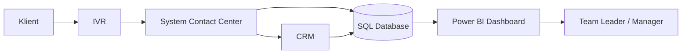
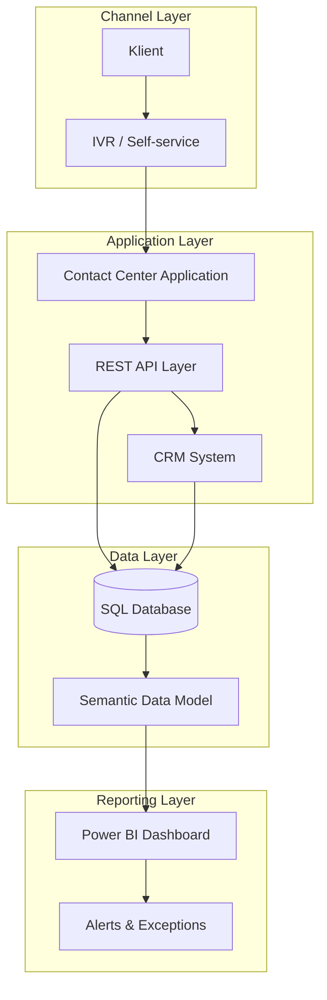
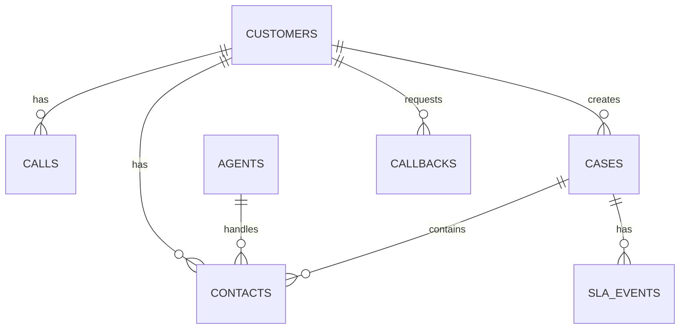

# Architektura rozwiązania — Contact Center

## Cel dokumentu

Dokument opisuje koncepcyjną architekturę rozwiązania wspierającego proces obsługi połączeń w Contact Center.

Architektura obejmuje komponenty odpowiedzialne za:

- obsługę połączeń przychodzących,
- obsługę IVR i samoobsługi,
- rejestrację zgłoszeń,
- obsługę callbacków,
- integrację z CRM,
- zasilenie modelu danych SQL,
- raportowanie KPI w Power BI.

Dokument ma charakter analityczny i przedstawia architekturę na poziomie logicznym, z perspektywy analityka biznesowo-systemowego.

---

## Kontekst rozwiązania

Proces Contact Center obejmuje obsługę klientów kontaktujących się w sprawach faktur, reklamacji, problemów technicznych oraz zgłoszeń wymagających eskalacji.

W procesie TO-BE założono usprawnienia:

- self-service w IVR dla prostych spraw,
- callback dla klientów oczekujących w kolejce,
- tagowanie przyczyn kontaktu,
- monitorowanie SLA,
- raportowanie KPI,
- analizę efektywności konsultantów i zespołów.

---

## Diagram kontekstowy

---

## Komponenty rozwiązania

| Komponent | Odpowiedzialność |
|---|---|
| IVR | Obsługa wyborów klienta, self-service, przekierowanie do konsultanta lub callback |
| System Contact Center | Obsługa połączeń, rejestracja kontaktów, przekazywanie spraw do konsultanta |
| CRM | Przechowywanie danych klienta, historii kontaktów i statusów spraw |
| SQL Database | Centralny model danych wykorzystywany do analizy operacyjnej |
| Power BI | Warstwa raportowa prezentująca KPI i alerty operacyjne |
| Back Office / 2nd Line | Obsługa spraw wymagających eskalacji |
| API Layer | Warstwa komunikacji pomiędzy komponentami systemu |

---

## Architektura logiczna

---

## Opis warstw architektury

### 1. Warstwa kanałów

Warstwa kanałów odpowiada za pierwszy kontakt klienta z organizacją.

| Element | Opis |
|---|---|
| Klient | Osoba kontaktująca się z Contact Center |
| IVR | System obsługujący wybór tematu sprawy, self-service i callback |
| Self-service | Obsługa prostych spraw bez udziału konsultanta |

---

### 2. Warstwa aplikacyjna

Warstwa aplikacyjna odpowiada za obsługę procesu biznesowego.

| Element | Opis |
|---|---|
| Contact Center Application | Obsługa połączeń, przekierowania, rejestracja kontaktów |
| REST API Layer | Komunikacja pomiędzy systemami |
| CRM System | Dane klienta, historia kontaktów, statusy spraw |
| Back Office / 2nd Line | Obsługa spraw eskalowanych |

---

### 3. Warstwa danych

Warstwa danych odpowiada za gromadzenie informacji potrzebnych do analizy operacyjnej.

| Element | Opis |
|---|---|
| SQL Database | Relacyjna baza danych z tabelami calls, cases, contacts, agents, customers |
| Semantic Data Model | Model danych przygotowany pod raportowanie KPI |
| Data Quality Rules | Reguły spójności i kompletności danych |

---

### 4. Warstwa raportowa

Warstwa raportowa odpowiada za prezentację KPI i alertów.

| Element | Opis |
|---|---|
| Power BI Dashboard | Dashboard operacyjny i zarządczy |
| Alerts & Exceptions | Widok spraw po SLA, niezrealizowanych callbacków i wysokiego AHT |
| KPI Monitoring | Monitorowanie SLA, FCR, AHT, ASA, Abandonment Rate |

---

## Przepływ danych

---

## Kluczowe przepływy biznesowe

### PF.01 — Obsługa połączenia przez konsultanta

| Krok | Opis |
|---|---|
| 1 | Klient wykonuje połączenie do Contact Center |
| 2 | IVR identyfikuje temat sprawy |
| 3 | Połączenie trafia do kolejki |
| 4 | Konsultant obsługuje klienta |
| 5 | System zapisuje dane kontaktu |
| 6 | Dane zasilają model raportowy |

---

### PF.02 — Self-service w IVR

| Krok | Opis |
|---|---|
| 1 | Klient wybiera temat sprawy w IVR |
| 2 | System identyfikuje prostą sprawę możliwą do samoobsługi |
| 3 | IVR obsługuje sprawę bez konsultanta |
| 4 | System zapisuje zdarzenie self-service |
| 5 | Dane są wykorzystywane do wyliczenia Self-service Rate |

---

### PF.03 — Callback

| Krok | Opis |
|---|---|
| 1 | Klient oczekuje w kolejce |
| 2 | IVR proponuje callback |
| 3 | Klient wybiera oddzwonienie |
| 4 | System zapisuje zgłoszenie callbacku |
| 5 | Callback otrzymuje status „Zaplanowany” |
| 6 | Realizacja callbacku jest monitorowana w dashboardzie |

---

### PF.04 — Eskalacja do 2nd line

| Krok | Opis |
|---|---|
| 1 | Konsultant identyfikuje sprawę wymagającą wsparcia |
| 2 | Sprawa zostaje oznaczona jako eskalowana |
| 3 | System zapisuje powód eskalacji |
| 4 | Zgłoszenie trafia do 2nd line |
| 5 | Eskalacja jest widoczna w raportach KPI |

---

## Integracje systemowe

| Integracja | Kierunek | Cel |
|---|---|---|
| IVR → Contact Center | Jednokierunkowa | Przekazanie tematu sprawy, wyboru self-service lub callbacku |
| Contact Center → CRM | Dwukierunkowa | Pobranie danych klienta i aktualizacja historii kontaktów |
| Contact Center → SQL Database | Jednokierunkowa | Zapis danych operacyjnych |
| CRM → SQL Database | Jednokierunkowa | Zasilenie modelu danych informacjami o kliencie |
| SQL Database → Power BI | Jednokierunkowa | Raportowanie KPI i alertów |

---

## Model danych na poziomie logicznym

| Encja | Opis |
|---|---|
| customers | Dane klientów |
| calls | Dane połączeń przychodzących |
| cases | Dane zgłoszeń i spraw |
| contacts | Historia kontaktów klienta |
| agents | Dane konsultantów |
| callbacks | Dane callbacków |
| sla_events | Dane dotyczące realizacji SLA |

---

## Relacje danych

---

## Wymagania architektoniczne

| ID | Wymaganie | Opis |
|---|---|---|
| AR.01 | Modularność | Komponenty rozwiązania powinny być logicznie rozdzielone |
| AR.02 | Skalowalność | Rozwiązanie powinno obsługiwać wzrost liczby połączeń |
| AR.03 | Audytowalność | Kluczowe operacje powinny być rejestrowane |
| AR.04 | Integracyjność | Komponenty powinny udostępniać dane przez API lub warstwę danych |
| AR.05 | Raportowalność | Dane powinny umożliwiać wyliczanie KPI operacyjnych |
| AR.06 | Bezpieczeństwo | Komunikacja pomiędzy komponentami powinna być szyfrowana |

---

## Wymagania niefunkcjonalne powiązane z architekturą

| ID | Obszar | Wymaganie |
|---|---|---|
| WN.01 | Wydajność | Czas odpowiedzi dla podstawowych operacji nie powinien przekraczać 2 sekund |
| WN.02 | Dostępność | Dostępność rozwiązania minimum 99,5% |
| WN.03 | Bezpieczeństwo | Komunikacja przez HTTPS |
| WN.04 | Skalowalność | Obsługa minimum 10 000 połączeń dziennie |
| WN.05 | Audyt | Logowanie operacji użytkowników |

---

## Powiązanie architektury z KPI

| KPI | Źródło danych | Komponent |
|---|---|---|
| SLA | cases, sla_events | SQL Database / Power BI |
| FCR | cases, contacts | SQL Database / Power BI |
| AHT | calls, contacts | SQL Database / Power BI |
| ASA | calls | SQL Database / Power BI |
| Abandonment Rate | calls | SQL Database / Power BI |
| Callback Realization Rate | callbacks | SQL Database / Power BI |
| Self-service Rate | calls | IVR / SQL Database / Power BI |

---

## Założenia architektoniczne

| ID | Założenie |
|---|---|
| ZA.01 | Projekt przedstawia architekturę koncepcyjną, a nie pełną implementację produkcyjną |
| ZA.02 | Dane w projekcie są przykładowe |
| ZA.03 | Model danych został przygotowany pod potrzeby raportowania KPI |
| ZA.04 | Power BI korzysta z danych zgromadzonych w relacyjnej bazie SQL |
| ZA.05 | API opisane w projekcie ma charakter analityczny |
| ZA.06 | Integracje z IVR i CRM zostały opisane koncepcyjnie |

---

## Ograniczenia

| ID | Ograniczenie | Opis |
|---|---|---|
| OG.01 | Brak produkcyjnej aplikacji Contact Center | Projekt koncentruje się na analizie procesu, danych i raportowaniu |
| OG.02 | Brak rzeczywistej integracji z CRM | Integracja została opisana na poziomie logicznym |
| OG.03 | Brak rzeczywistego IVR | Scenariusze IVR zostały odwzorowane w danych i procesie BPMN |
| OG.04 | Brak warstwy autoryzacji | Bezpieczeństwo zostało opisane jako założenie architektoniczne |
| OG.05 | Brak wdrożenia API | Endpointy zostały opisane w specyfikacji analitycznej |

---

## Decyzje architektoniczne

| ID | Decyzja | Uzasadnienie |
|---|---|---|
| ADR.01 | Wykorzystanie relacyjnej bazy SQL | Dane Contact Center mają strukturę relacyjną i nadają się do raportowania KPI |
| ADR.02 | Wykorzystanie Power BI jako warstwy raportowej | Power BI umożliwia szybkie przygotowanie dashboardów operacyjnych |
| ADR.03 | Oddzielenie warstwy danych od warstwy raportowej | Ułatwia utrzymanie modelu i dalszą rozbudowę raportowania |
| ADR.04 | Opis API w stylu REST | REST API jest czytelnym sposobem opisu integracji systemowych |
| ADR.05 | Wprowadzenie self-service i callbacku | Mechanizmy te wspierają ograniczenie kolejek i porzuconych połączeń |

---

## Podsumowanie

Architektura rozwiązania Contact Center została zaprojektowana tak, aby wspierać analizę procesu obsługi klienta, monitorowanie KPI oraz podejmowanie decyzji operacyjnych na podstawie danych.

Projekt pokazuje powiązanie pomiędzy:

- procesem biznesowym BPMN,
- wymaganiami biznesowymi,
- integracjami systemowymi,
- modelem danych SQL,
- REST API,
- dashboardem Power BI,
- KPI operacyjnymi.

