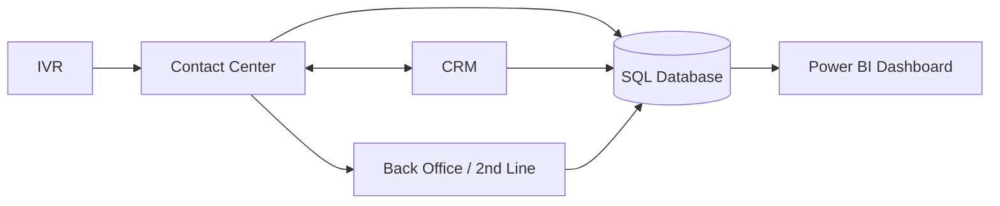

# Analiza integracji — Contact Center

## Cel dokumentu

Celem dokumentu jest opisanie koncepcyjnych integracji pomiędzy komponentami rozwiązania Contact Center oraz określenie głównych przepływów danych wykorzystywanych w procesie obsługi połączeń, callbacków, eskalacji oraz raportowania KPI.

Dokument przedstawia integracje na poziomie analitycznym, z perspektywy analityka biznesowo-systemowego.

---

## Zakres dokumentu

Dokument obejmuje:

- identyfikację komponentów systemowych,
- macierz integracji,
- kierunki przepływu danych,
- zakres danych przekazywanych pomiędzy systemami,
- częstotliwość wymiany danych,
- reguły walidacji danych,
- scenariusze błędów,
- ryzyka integracyjne,
- powiązanie integracji z wymaganiami i KPI.

---

## Komponenty rozwiązania

| Komponent | Rola w rozwiązaniu |
|---|---|
| IVR | Obsługa wyborów klienta, self-service, callback, przekierowanie do kolejki |
| Contact Center | Obsługa połączeń, rejestracja kontaktów, przypisanie konsultanta |
| CRM | Dane klienta, historia kontaktów, statusy spraw, segmentacja klientów |
| SQL Database | Centralna warstwa danych operacyjnych i raportowych |
| Power BI | Warstwa raportowa prezentująca KPI, trendy i alerty |
| Back Office / 2nd Line | Obsługa spraw wymagających eskalacji |
| REST API Layer | Warstwa komunikacji pomiędzy komponentami |

---

## Diagram przepływu danych

---

## Macierz integracji

| ID | Integracja | Kierunek | Typ integracji | Cel biznesowy |
|---|---|---|---|---|
| INT.01 | IVR → Contact Center | Jednokierunkowa | Event / API | Przekazanie wyborów klienta i informacji o połączeniu |
| INT.02 | Contact Center ↔ CRM | Dwukierunkowa | REST API | Pobranie danych klienta i aktualizacja historii kontaktów |
| INT.03 | Contact Center → SQL Database | Jednokierunkowa | ETL / Batch / API | Zapis danych operacyjnych do modelu raportowego |
| INT.04 | CRM → SQL Database | Jednokierunkowa | ETL / Batch | Zasilenie modelu danych informacjami o klientach |
| INT.05 | Back Office / 2nd Line → SQL Database | Jednokierunkowa | ETL / Batch | Zasilenie modelu informacjami o eskalacjach i statusach spraw |
| INT.06 | SQL Database → Power BI | Jednokierunkowa | Import / DirectQuery | Udostępnienie danych do raportowania KPI |
| INT.07 | Contact Center → REST API Layer | Dwukierunkowa | REST API | Obsługa operacji callback, ticket, customer i KPI |

---

# INT.01 — Integracja IVR z Contact Center

## Cel integracji

Integracja umożliwia przekazanie informacji z IVR do systemu Contact Center w celu poprawnego obsłużenia połączenia przychodzącego.

## Zakres danych

| Dane | Opis | Wymagane |
|---|---|---|
| phoneNumber | Numer telefonu klienta | Tak |
| ivrTopic | Wybrany temat sprawy w IVR | Tak |
| callStartTime | Data i czas rozpoczęcia połączenia | Tak |
| selfServiceSelected | Informacja, czy klient wybrał self-service | Nie |
| callbackSelected | Informacja, czy klient wybrał callback | Nie |
| queueName | Kolejka, do której przekazano połączenie | Nie |

## Reguły biznesowe

| ID | Reguła |
|---|---|
| BR.INT.01 | Jeżeli klient wybierze self-service, połączenie nie musi być przekazane do konsultanta |
| BR.INT.02 | Jeżeli klient wybierze callback, system powinien zapisać zgłoszenie oddzwonienia |
| BR.INT.03 | Każde połączenie powinno mieć przypisany temat sprawy lub kategorię techniczną „UNKNOWN” |
| BR.INT.04 | Czas rozpoczęcia połączenia jest wymagany do wyliczenia ASA i AHT |

## Powiązane KPI

| KPI | Wpływ integracji |
|---|---|
| ASA | Pomiar czasu oczekiwania na odpowiedź |
| Abandonment Rate | Identyfikacja połączeń porzuconych |
| Self-service Rate | Monitorowanie udziału spraw obsłużonych w IVR |
| Callback Rate | Monitorowanie liczby wybranych callbacków |

---

# INT.02 — Integracja Contact Center z CRM

## Cel integracji

Integracja umożliwia konsultantowi dostęp do danych klienta oraz historii wcześniejszych kontaktów podczas obsługi połączenia.

## Kierunek wymiany danych

| Kierunek | Opis |
|---|---|
| Contact Center → CRM | Zapytanie o dane klienta |
| CRM → Contact Center | Zwrot danych klienta i historii kontaktów |
| Contact Center → CRM | Aktualizacja historii kontaktu po zakończeniu rozmowy |

## Zakres danych pobieranych z CRM

| Dane | Opis | Wymagane |
|---|---|---|
| customerId | Identyfikator klienta | Tak |
| customerSegment | Segment klienta, np. B2C, SME, Corporate | Tak |
| customerStatus | Status klienta, np. ACTIVE, INACTIVE | Tak |
| openCases | Liczba aktywnych spraw | Nie |
| interactionHistory | Historia kontaktów klienta | Nie |

## Zakres danych zapisywanych do CRM

| Dane | Opis | Wymagane |
|---|---|---|
| contactId | Identyfikator kontaktu | Tak |
| contactDate | Data kontaktu | Tak |
| contactCategory | Kategoria sprawy | Tak |
| contactResult | Wynik rozmowy | Tak |
| ticketStatus | Status zgłoszenia | Nie |

## Reguły biznesowe

| ID | Reguła |
|---|---|
| BR.INT.05 | Dane klienta powinny być pobierane przed rozpoczęciem obsługi przez konsultanta |
| BR.INT.06 | Historia kontaktu powinna być zapisana po zakończeniu rozmowy |
| BR.INT.07 | Kategoria kontaktu jest wymagana do zamknięcia zgłoszenia |
| BR.INT.08 | Brak klienta w CRM powinien skutkować obsługą jako klient niezidentyfikowany |

## Powiązane wymagania

| ID | Wymaganie |
|---|---|
| WF.02 | Identyfikacja klienta |
| WF.03 | Rejestracja przyczyny kontaktu |
| WF.07 | Dane do raportowania KPI |

---

# INT.03 — Integracja Contact Center z SQL Database

## Cel integracji

Integracja odpowiada za zasilenie relacyjnej bazy danych informacjami operacyjnymi wykorzystywanymi w dashboardzie Power BI.

## Zakres danych

| Obszar danych | Przykładowe tabele | Opis |
|---|---|---|
| Połączenia | calls | Wolumen połączeń, kolejki, statusy, czasy |
| Zgłoszenia | cases | Sprawy klientów, statusy, SLA, eskalacje |
| Kontakty | contacts | Historia kontaktów klienta |
| Konsultanci | agents | Dane konsultantów i zespołów |
| Klienci | customers | Dane klientów i segmenty |
| Callbacki | callbacks | Dane o oddzwonieniach |

## Częstotliwość zasilania

| Tryb | Opis | Zastosowanie |
|---|---|---|
| Batch | Dane ładowane cyklicznie | Raportowanie dzienne i historyczne |
| Near real-time | Dane aktualizowane z niewielkim opóźnieniem | Monitoring operacyjny |
| Manual refresh | Odświeżenie na żądanie | Projekt portfolio / dane przykładowe |

## Reguły jakości danych

| ID | Reguła jakości danych |
|---|---|
| DQ.01 | Każde połączenie powinno mieć unikalny identyfikator call_id |
| DQ.02 | Każde zgłoszenie powinno mieć status |
| DQ.03 | Każdy kontakt powinien być powiązany z klientem lub oznaczony jako niezidentyfikowany |
| DQ.04 | Czas zakończenia połączenia nie może być wcześniejszy niż czas rozpoczęcia |
| DQ.05 | Callback powinien mieć status: SCHEDULED, COMPLETED, CANCELLED lub MISSED |
| DQ.06 | Sprawy po SLA powinny być możliwe do identyfikacji w modelu danych |

## Powiązane KPI

| KPI | Źródło danych |
|---|---|
| AHT | calls, contacts |
| ASA | calls |
| FCR | cases, contacts |
| SLA | cases |
| Abandonment Rate | calls |
| Callback Realization Rate | callbacks |

---

# INT.04 — Integracja CRM z SQL Database

## Cel integracji

Integracja umożliwia wykorzystanie danych klienta w analizie operacyjnej i segmentacyjnej.

## Zakres danych

| Dane | Opis |
|---|---|
| customerId | Identyfikator klienta |
| customerSegment | Segment klienta |
| customerStatus | Status klienta |
| customerType | Typ klienta |
| registrationDate | Data rejestracji klienta |

## Zastosowanie danych w raportowaniu

| Obszar raportowania | Przykład użycia |
|---|---|
| Segmentacja klientów | Analiza FCR według segmentu |
| Analiza wolumenu | Liczba kontaktów według typu klienta |
