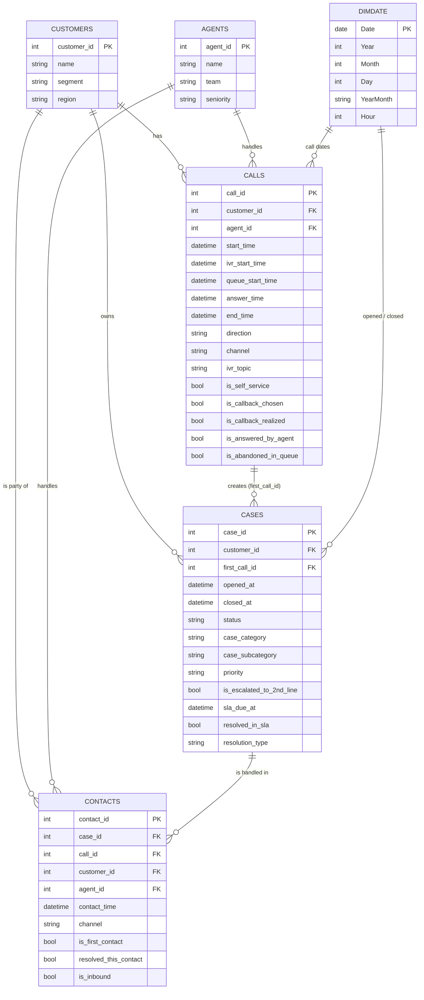

# Model danych i KPI

## 1. Diagram modelu danych

Model jest zbudowany w układzie zbliżonym do **star schema** – tabele faktów (`calls`, `cases`, `contacts`) połączone z wymiarami (`customers`, `agents`, `dimDate`) oraz techniczną tabelą miar (`measures_all`).

Poniżej diagram w formacie **Mermaid** (GitHub wyświetli go jako grafikę):

## 2. Tabele i ich rola w modelu

| Tabela | Rola w modelu | Ziarnistość (grain) | Klucz główny | Najważniejsze relacje |
|---|---|---|---|---|
| `calls` | fact | 1 wiersz = 1 połączenie (inbound / outbound, IVR / agent) | `call_id` | `customer_id` → `customers.customer_id` • `agent_id` → `agents.agent_id` • daty → `dimDate[Date]` (np. po `start_time`) |
| `cases` | fact | 1 wiersz = 1 sprawa / zgłoszenie | `case_id` | `customer_id` → `customers.customer_id` • `first_call_id` → `calls.call_id` • daty → `dimDate[Date]` (`opened_at`, `closed_at`) |
| `contacts` | fact | 1 wiersz = 1 kontakt konsultanta w ramach sprawy | `contact_id` | `case_id` → `cases.case_id` • `call_id` → `calls.call_id` • `customer_id` → `customers.customer_id` • `agent_id` → `agents.agent_id` |
| `agents` | dimension | 1 wiersz = 1 konsultant | `agent_id` | Łączona z `calls.agent_id` i `contacts.agent_id` |
| `customers` | dimension | 1 wiersz = 1 klient | `customer_id` | Łączona z `calls.customer_id`, `cases.customer_id`, `contacts.customer_id` |
| `dimDate` | dimension | 1 wiersz = 1 dzień (opcjonalnie godzina) | `Date` | Łączona z polami daty w faktach (`calls.start_time`, `cases.opened_at`, `cases.closed_at`) |
| `measures_all` | helper | Tabela techniczna – przechowuje wyłącznie miary DAX | – | Służy do grupowania wszystkich KPI w jednym miejscu (ASA, AHT, FCR, SLA, Abandonment, Self-service, Callback itd.) |

## 3. Opis modelu danych

Model łączy perspektywę procesową (połączenia, sprawy, kontakty) z wymiarami klientów, konsultantów i czasu.

### 3.1. Wymiary

- `customers` – dane klientów (segment B2C/SME/Corporate, region), do analizy zachowań i obciążenia według segmentów.
- `agents` – dane konsultantów (zespół 1st/2nd line, seniority), do analizy efektywności zespołów i pojedynczych osób.
- `dimDate` – wymiar czasu (dzień, opcjonalnie godzina) do spójnego filtrowania i agregacji metryk.

### 3.2. Fakty procesowe

- `calls` – każdy telefon do / z contact center:
  - czasy: wejście na infolinię, wejście do IVR, wejście do kolejki, odebranie, zakończenie,
  - temat z IVR (faktury, reklamacje, techniczne),
  - flagi: samoobsługa, callback, porzucenie w kolejce, odebrane przez agenta.

- `cases` – zgłoszenia:
  - kategoria (billing, reklamacje, techniczne),
  - priorytet,
  - eskalacja do 2nd line,
  - pola SLA (`sla_due_at`, `resolved_in_sla`),
  - sposób rozwiązania (`resolution_type`: `FCR` / `after_escalation` / `self_service` / `no_solution`).

- `contacts` – każdy kontakt konsultanta w ramach sprawy:
  - który agent rozmawiał z klientem,
  - czy był to pierwszy kontakt,
  - czy sprawa została zamknięta w tym kontakcie.

### 3.3. Co umożliwia model

Dzięki takiej strukturze można:

- prześledzić cały flow połączenia: `IVR → kolejka → konsultant → zgłoszenie → rozwiązanie`,
- analizować `SLA` i `FCR` na poziomie spraw (`cases`),
- badać efektywność `self-service` i `callback`,
- porównywać wyniki zespołów i agentów oraz segmentów klientów.

## 4. Kluczowe KPI (logika biznesowa)

Poniżej logika najważniejszych KPI, które są zaimplementowane w miarach DAX w tabeli `measures_all`.

> Uwaga: nazwy pól są przykładowe i powinny odpowiadać implementacji w modelu (np. `queue_start_time`, `answer_time`, `end_time`).

### 4.1. Połączenia i kolejki

- **Total Inbound Calls** – liczba wszystkich połączeń przychodzących (`direction = 'inbound'`).
- **Answered Calls** – połączenia z `is_answered_by_agent = 1`.
- **Abandoned In Queue** – połączenia z `is_abandoned_in_queue = 1`.
- **ASA (Average Speed of Answer)** – średni czas od wejścia do kolejki (`queue_start_time`) do odebrania (`answer_time`).
- **AHT (Average Handle Time)** – średni czas od odebrania (`answer_time`) do zakończenia (`end_time`).
- **Queue Time (avg / p95)** – średni i 95-ty percentyl czasu oczekiwania w kolejce.

### 4.2. Jakość obsługi

- **FCR Cases** – liczba spraw z `resolution_type = 'FCR'`.
- **FCR Rate** – udział FCR Cases w ogólnej liczbie spraw.
- **Cases in SLA** – sprawy z `resolved_in_sla = 1`.
- **SLA Rate** – udział spraw w SLA w ogólnej liczbie zamkniętych spraw.
- **Escalated Cases / Escalation Rate** – sprawy z `is_escalated_to_2nd_line = 1` i ich udział procentowy.

### 4.3. Self-service i callback

- **Self-service Calls** – połączenia z `is_self_service = 1`.
- **Self-service Rate** – udział samoobsługi w całkowitej liczbie połączeń.
- **Callback Selected** – połączenia, w których klient wybrał callback (`is_callback_chosen = 1`).
- **Callback Realized** – oddzwonienia zrealizowane (`is_callback_realized = 1`).
- **Callback Rate** – udział połączeń z wyborem callbacku.
- **Callback FCR** – sprawy rozwiązane podczas callbacku (np. `direction = 'outbound'` + `resolution_type = 'FCR'`).
- **Callback Delay** – średni czas między pierwszym połączeniem a zrealizowanym oddzwonieniem.

  ## Słownik miar DAX

| Nazwa miary                | Skrót | Opis                                                       | Format     |
|----------------------------|-------|------------------------------------------------------------|-----------|
| Total Inbound Calls        | TIC   | Łączna liczba połączeń przychodzących                      | Liczba     |
| Answered Calls             | AC    | Liczba połączeń odebranych przez konsultantów              | Liczba     |
| Abandonment Rate           | AR    | Odsetek porzuconych połączeń                               | %         |
| ASA (sec)                  | ASA   | Average Speed of Answer – średni czas oczekiwania (sekundy)| Liczba     |
| AHT (sec)                  | AHT   | Average Handle Time – średni czas obsługi (sekundy)        | Liczba     |
| Queue Time (sec)           | QT    | Średni czas spędzony w kolejce                             | Liczba     |
| Self-service Calls         | SSC   | Liczba spraw załatwionych w IVR                            | Liczba     |
| Self-service Rate          | SSR   | Udział spraw załatwionych w IVR                            | %         |
| Callback Selected          | CBS   | Liczba klientów, którzy wybrali oddzwonienie               | Liczba     |
| Callback Not Realized      | CBNR  | Liczba niezrealizowanych callbacków                        | Liczba     |
| Callback Not Realized %    | CBNR% | Odsetek niezrealizowanych callbacków                       | %         |
| Cases Total                | CT    | Liczba spraw w tabeli `cases`                              | Liczba     |
| Cases in SLA               | CSLA  | Liczba spraw zamkniętych w terminie SLA                    | Liczba     |
| SLA Rate                   | SLAR  | Odsetek spraw zamkniętych w terminie SLA                   | %         |
| FCR Cases                  | FCRC  | Liczba spraw rozwiązanych przy pierwszym kontakcie         | Liczba     |
| FCR Rate                   | FCRR  | Odsetek spraw z FCR                                        | %         |
| FCR Rate by Agent          | FCRRA | FCR liczony na poziomie konsultanta                        | %         |
| Escalated Cases            | ESC   | Liczba spraw eskalowanych do 2nd line                      | Liczba     |
| Escalation Rate            | ESR   | Odsetek spraw eskalowanych                                 | %         |
| Cases Past SLA             | CPS   | Liczba spraw zamkniętych po upływie SLA                    | Liczba     |
| SLA Overdue (days)         | SLOD  | Liczba dni opóźnienia względem daty SLA                     | Liczba     |

